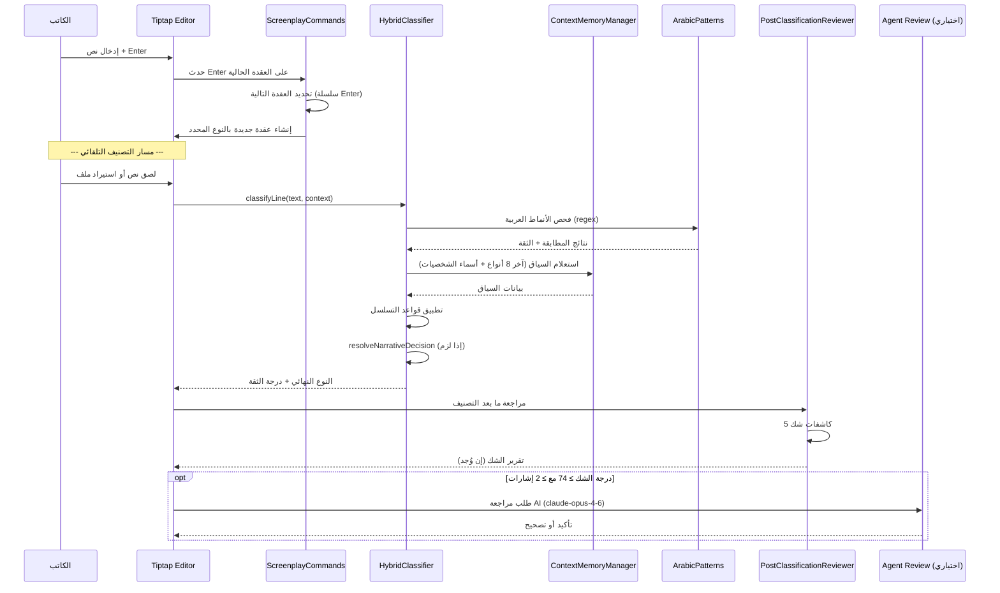
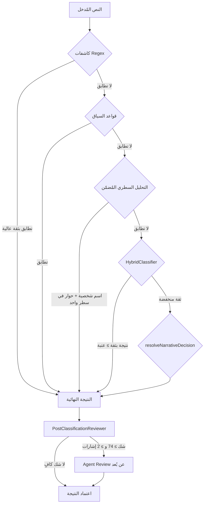
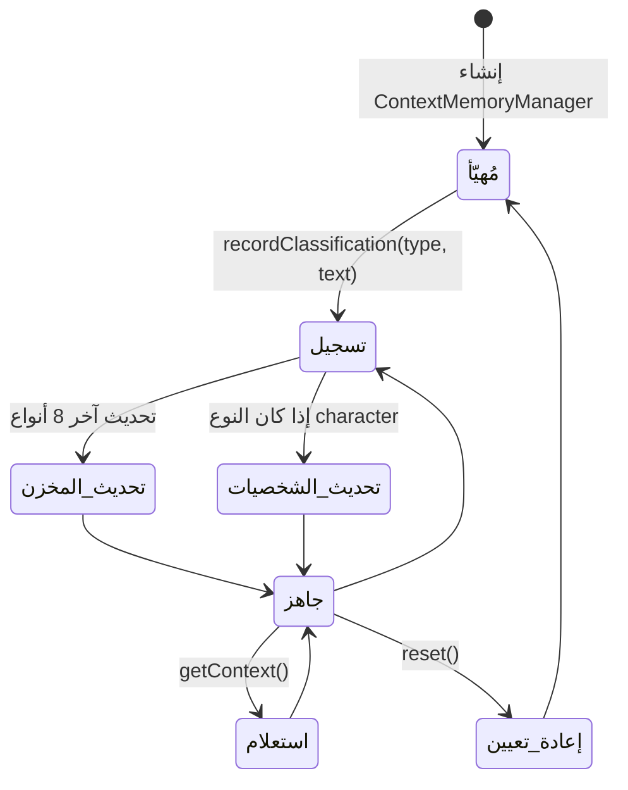
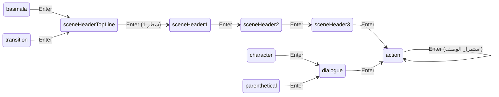
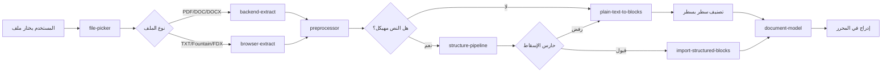
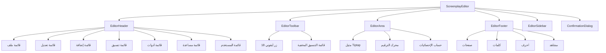
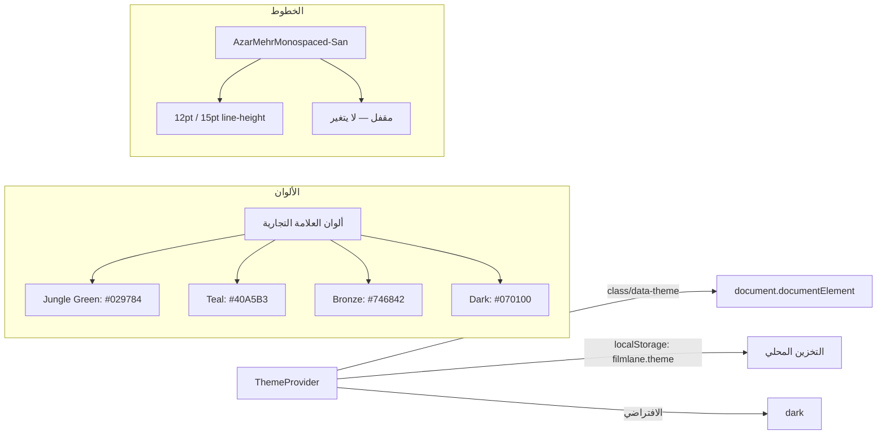

# آلية العمل الأساسية — أفان تيتر (Avan Titre)

> آخر تحديث: 2026-02-22

---

## 1. الملخص التنفيذي

أفان تيتر هو محرر نصوص سيناريو عربي مبني على React 19 + Tiptap (ProseMirror) مع نمط معماري هجين: React للغلاف الخارجي (shell)، وفئات حتمية (imperative classes) لمحرك التحرير والمكونات البصرية.

المحرر يعالج ثلاث مشكلات جوهرية في وقت واحد:

1. **التصنيف التلقائي**: تحويل النص العربي العادي إلى عناصر سيناريو مهيكلة (مشهد، حوار، وصف، شخصية...) عبر خط أنابيب متعدد الطبقات
2. **التنقل الذكي**: سلسلة مفتاح Enter وتدوير Tab تنقل الكاتب بين أنواع العناصر بتسلسل منطقي يحاكي سير الكتابة الطبيعي
3. **التخطيط الصفحي**: محاكاة صفحة A4 حقيقية داخل المتصفح مع ترقيم وتقسيم تلقائي

---

## 2. طبقات المعمارية

| الطبقة | المسؤولية | الملفات الأساسية |
|--------|-----------|-----------------|
| **نقطة الدخول** | تهيئة React + CSS + mount | `main.tsx`, `App.tsx` |
| **الغلاف البصري** | القوائم، الشريط الجانبي، شريط الأدوات، التذييل | `EditorHeader.ts`, `EditorToolbar.ts`, `EditorSidebar.ts`, `EditorFooter.ts` |
| **المُنسّق** | تنسيق المكونات + اختصارات لوحة المفاتيح + عمليات الملفات | `ScreenplayEditor.ts` |
| **محرك التحرير** | إنشاء Tiptap + ترقيم الصفحات + إحصائيات | `EditorArea.ts`, `editor.ts` |
| **عُقد السيناريو** | 10 أنواع عناصر + سلسلة Enter + اختصارات Tab | `extensions/*.ts` |
| **خط أنابيب التصنيف** | regex → سياق → هجين → مراجعة ما بعد التصنيف → وكيل AI | `classification-*.ts`, `hybrid-classifier.ts`, `arabic-patterns.ts` |
| **استيراد الملفات** | فتح ملفات خارجية → استخراج → معالجة → تصنيف → استيراد | `utils/file-import/*.ts` |
| **البنية التحتية** | أنماط، ألوان، خطوط، أبعاد الصفحة، سجلات | `constants/`, `styles/`, `utils/logger.ts` |

---

## 3. دورة حياة النص — من الإدخال إلى التصنيف



---

## 4. خط أنابيب التصنيف — التفصيل

### 4.1 الأولويات

خط التصنيف يعمل بنظام الأولويات التنازلية. أول طبقة تُعيد نتيجة بثقة كافية تُنهي السلسلة:



### 4.2 كاشفات الأنماط العربية (`arabic-patterns.ts`)

| الكاشف | الوصف | أمثلة |
|--------|-------|-------|
| `isSceneHeader` | أنماط رؤوس المشاهد العربية | `داخلي -`, `خارجي /`, `مشهد 1:` |
| `isTransition` | أنماط الانتقال | `قطع إلى:`, `انتقال إلى:`, `مزج إلى:` |
| `isCharacterName` | اسم شخصية (أحرف عربية بدون أفعال) | `أحمد:`, `أم سعيد`, `الضابط` |
| `isParenthetical` | تعليمات الحوار بين أقواس | `(بغضب)`, `(همساً)` |
| `isDialogue` | حوار (يبدأ بعلامة تنصيص أو بعد اسم شخصية) | `"أنا لن أقبل"`, حوار مباشر |
| `isActionVerb` | 52 فعل وصفي للحركة | `يدخل`, `تجلس`, `يمسك`, `تنظر` |
| `isBasmala` | البسملة | `بسم الله الرحمن الرحيم` |
| `detectDialect` | كشف اللهجة (مصرية، شامية، خليجية) | أنماط لهجوية محددة |

### 4.3 إدارة ذاكرة السياق (`context-memory-manager.ts`)



المدير يحتفظ بـ:
- **آخر 8 أنواع مُصنّفة**: لاكتشاف التسلسلات غير المنطقية
- **تكرارات أسماء الشخصيات**: لتعزيز ثقة تصنيف الأسماء المتكررة
- **السطر السابق**: للقرارات السياقية المباشرة

### 4.4 قرار السرد (`resolveNarrativeDecision`)

عندما تفشل جميع الكاشفات في الوصول لثقة كافية، يُستخدم نظام النقاط:

| العامل | التأثير |
|--------|---------|
| يبدأ بفعل وصفي | +نقاط لـ action |
| يلي اسم شخصية مباشرة | +نقاط لـ dialogue |
| قصير (< 5 كلمات) وبدون أفعال | +نقاط لـ character |
| يلي حوار | +نقاط لـ action (الوصف يلي الحوار عادةً) |
| يحتوي علامات ترقيم حوارية | +نقاط لـ dialogue |

### 4.5 مراجعة ما بعد التصنيف (`PostClassificationReviewer`)

5 كاشفات شك تعمل بالتوازي:

1. **انتهاك التسلسل**: هل النوع الحالي يتبع النوع السابق بشكل منطقي؟
2. **ثقة منخفضة**: هل درجة الثقة أقل من العتبة؟
3. **طول غير متوقع**: هل طول السطر غير معتاد لهذا النوع؟
4. **تناقض السياق**: هل يتعارض التصنيف مع ذاكرة السياق؟
5. **نمط مشبوه**: هل يحتوي السطر على سمات نوع مختلف؟

**عتبات التفعيل**: درجة شك ≥ 74، نسبة شك قصوى 0.08 من إجمالي الأسطر، حد أدنى 2 إشارات شك.

---

## 5. سلسلة مفتاح Enter — آلة الحالة



كل عقدة Tiptap مخصصة تُعرّف `addKeyboardShortcuts()` مع معالج Enter الخاص بها. المعالج:
1. يقرأ النوع الحالي للعقدة
2. يحدد النوع التالي من خريطة السلسلة
3. يُنشئ عقدة جديدة بالنوع المحدد بعد الموضع الحالي
4. ينقل المؤشر إلى العقدة الجديدة

### تدوير Tab

مفتاح Tab يُدوّر نوع العنصر الحالي عبر التسلسل:

```
action → character → dialogue → parenthetical → transition → action
```

يُدار بواسطة `ScreenplayCommands` extension الذي يقرأ نوع العقدة الحالية ويستبدلها بالنوع التالي في الدورة.

---

## 6. خط أنابيب استيراد الملفات



### أنواع الملفات المقبولة

| النوع | الامتداد | طريقة الاستخراج |
|-------|----------|----------------|
| PDF | `.pdf` | backend (OCR اختياري عبر Mistral) |
| Word | `.doc`, `.docx` | backend |
| نص عادي | `.txt` | browser (FileReader) |
| Fountain | `.fountain` | browser |
| Final Draft | `.fdx` | browser (XML parser) |

### المعالج المسبق (`preprocessor.ts`)

يُطبّق تطبيع خاص بنوع الملف:
- **PDF**: إزالة أرقام الصفحات، تنظيف الرؤوس/التذييلات المتكررة، توحيد الأسطر الفارغة
- **DOC/DOCX**: تحويل التنسيقات المرئية إلى أنماط منطقية
- **عام**: توحيد أحرف الأسطر الجديدة، إزالة المسافات الزائدة

---

## 7. نموذج المستند (`document-model.ts`)

```mermaid
flowchart TD
    A[ScreenplayDocument] --> B[metadata]
    A --> C[blocks: ScreenplayBlock[]]
    A --> D[settings]

    B --> B1[title]
    B --> B2[author]
    B --> B3[createdAt]
    B --> B4[version]

    C --> C1[type: ElementType]
    C --> C2[text: string]
    C --> C3[attrs: Record]

    A --> E[التسلسل: serialize]
    E --> F[ScreenplayPayloadV1]
    F --> F1[ترميز Base64]
    F --> F2[تدقيق FNV1a]
    F --> F3[إصدار البروتوكول]

    A --> G[التحويل]
    G --> G1[toHTML: blocks → HTML]
    G --> G2[fromHTML: HTML → blocks]
```

### حمولة الحافظة المخصصة

```
MIME: application/x-filmlane-blocks+json
```

الحمولة تحتوي: `plainText`, `html`, `blocks[]`, `sourceKind`, `hash`, `createdAt`.

---

## 8. تخطيط الصفحة والترقيم

| المعامل | القيمة |
|---------|--------|
| DPI | 96 |
| عرض الصفحة | 794px |
| ارتفاع الصفحة | 1123px |
| هامش علوي/سفلي | 77px |
| هامش أيسر | 96px |
| هامش أيمن | 120px |
| ارتفاع المحتوى | 969px |
| الفجوة بين الصفحات | 24px |

يُدار الترقيم بواسطة:
- **Tiptap Pages Extension**: يقسم المحتوى إلى صفحات A4 افتراضية
- **ResizeObserver**: يراقب تغيرات حجم المحتوى
- **MutationObserver**: يراقب تغيرات DOM للتحديث الفوري
- **إصلاح الأرامل (Widow Fix)**: يمنع بقاء سطر وحيد في نهاية الصفحة

---

## 9. النظام البصري — مكونات DOM الحتمية

جميع مكونات الواجهة مبنية بـ vanilla DOM بدون JSX:



### نمط مصنع المكونات (`_factory.ts`)

مكونات Radix UI مُغلّفة بمصنع DOM حتمي بدلاً من JSX. هذا النمط:
- يُنشئ عناصر DOM مباشرة عبر `document.createElement`
- يُطبّق الخصائص والأحداث برمجياً
- يُعيد مرجعاً للعنصر بدلاً من مكون React
- **الاستثناء الوحيد**: `hover-border-gradient.tsx` يستخدم JSX (مكون Aceternity UI)

---

## 10. نظام السمات والألوان



---

## 11. نظام الكتابة (`typing-system`)

ثلاثة أوضاع للكتابة:

| الوضع | الوصف |
|-------|-------|
| `plain` | كتابة عادية بدون تصنيف تلقائي |
| `auto-deferred` | تصنيف تلقائي مؤجل — يُصنّف عند الانتقال لسطر جديد |
| `auto-live` | تصنيف تلقائي فوري — يُصنّف أثناء الكتابة |

---

## 12. سجلات القرارات المعمارية (ADRs)

### ADR-001: نمط DOM الحتمي بدلاً من React للمكونات البصرية

**السياق**: المحرر يحتاج تحكماً دقيقاً في DOM لإدارة الترقيم والتنسيق.

**القرار**: استخدام فئات TypeScript حتمية (imperative classes) لبناء المكونات البصرية بدلاً من مكونات React الوظيفية.

**المبررات**:
- Tiptap/ProseMirror يعمل بنموذج حتمي أصلاً
- التحكم المباشر في DOM يمنع إعادة الرسم غير الضرورية
- أداء أفضل مع التحديثات المتكررة (كل ضغطة مفتاح)
- تجنب تعقيد المزامنة بين حالة React وحالة ProseMirror

**العواقب**: صعوبة أكبر في إعادة الاستخدام مقارنة بمكونات React، لكن أداء أفضل في سيناريو المحرر.

---

### ADR-002: خط أنابيب تصنيف متعدد الطبقات

**السياق**: تصنيف النص العربي لعناصر السيناريو يتطلب دقة عالية مع أداء فوري.

**القرار**: بناء خط أنابيب بأربع طبقات (regex → سياق → هجين → وكيل AI) بدلاً من نموذج AI واحد.

**المبررات**:
- الطبقات الأولى (regex + سياق) تُعالج 80%+ من الحالات بسرعة فورية
- التصعيد التدريجي يوفر تكلفة طلبات API
- المراجعة الخلفية تكتشف الأخطاء دون إبطاء الكتابة
- الوكيل AI اختياري ولا يُعطّل العمل عند عدم توفره

**العواقب**: تعقيد أكبر في صيانة القواعد، لكن أداء فوري واستقلالية عن الشبكة في الحالة العادية.

---

### ADR-003: خط واحد مقفل (`AzarMehrMonospaced-San`, 12pt)

**السياق**: السيناريوهات المحترفة تستخدم خطاً ثابت العرض بحجم ثابت.

**القرار**: قفل الخط والحجم — لا يُمكن تغييرهما من واجهة المستخدم.

**المبررات**:
- معيار صناعي: صفحة واحدة = دقيقة شاشة واحدة (تقريباً)
- التناسق البصري يضمن دقة الترقيم
- الخط أحادي العرض يضمن محاذاة الحوار والتعليمات

**العواقب**: مرونة أقل للمستخدم، لكن توافق مع المعايير المهنية.

---

### ADR-004: حمولة حافظة مخصصة بـ MIME خاص

**السياق**: النسخ واللصق بين التطبيقات يفقد معلومات التصنيف.

**القرار**: استخدام MIME مخصص (`application/x-filmlane-blocks+json`) للحافظة.

**المبررات**:
- الحفاظ على معلومات التصنيف عند النسخ/اللصق داخل التطبيق
- التراجع إلى النص العادي عند اللصق من مصادر خارجية
- تدقيق التكامل عبر FNV1a hash

**العواقب**: يتطلب معالجة خاصة لأحداث الحافظة، لكن يحافظ على سلامة البيانات.

---

### ADR-005: ذاكرة سياق قصيرة (8 عناصر)

**السياق**: التصنيف السياقي يحتاج معرفة بالعناصر السابقة.

**القرار**: الاحتفاظ بآخر 8 أنواع مُصنّفة + تكرارات أسماء الشخصيات.

**المبررات**:
- 8 عناصر تكفي لتغطية مشهد كامل نموذجي
- حجم ثابت في الذاكرة (لا نمو غير محدود)
- تكرارات الشخصيات تُعزز ثقة التعرف عند إعادة الظهور

**العواقب**: فقدان السياق البعيد، لكن كفاية تامة للتصنيف اللحظي.
