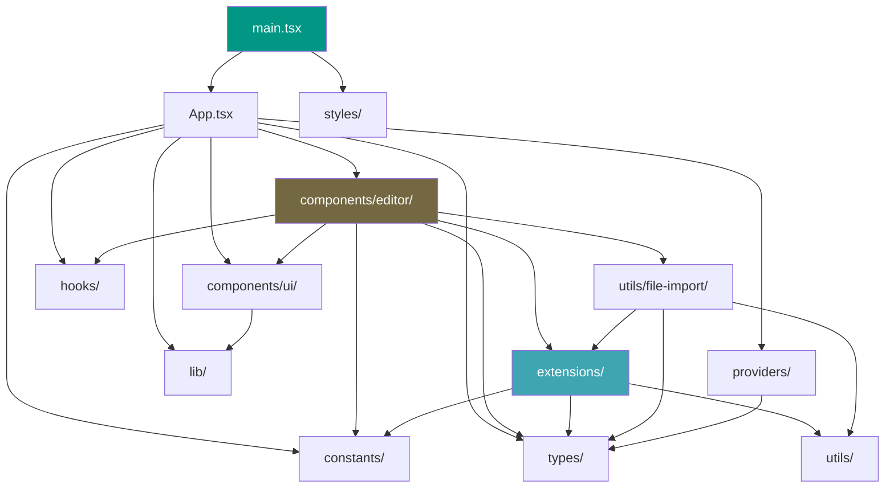
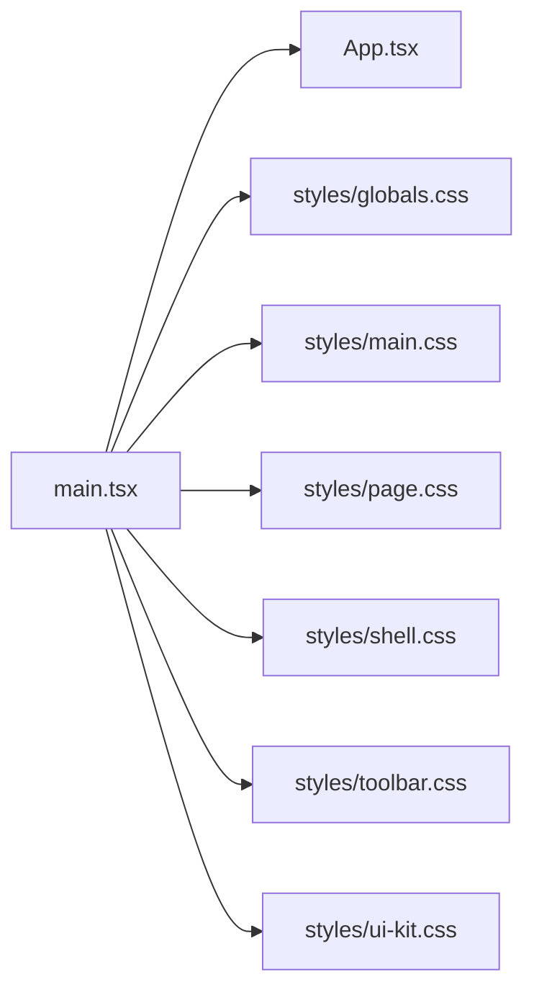
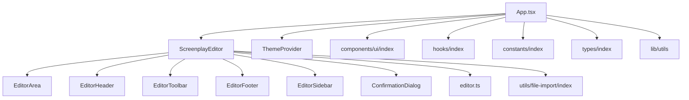
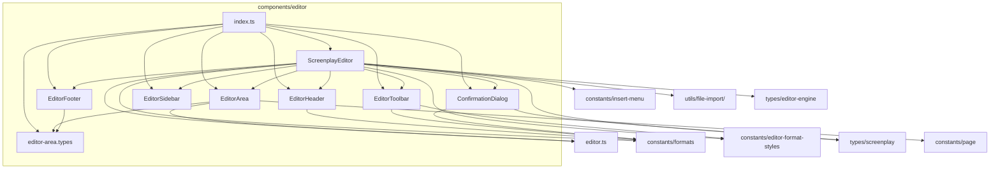
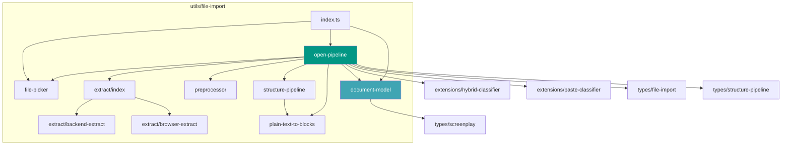
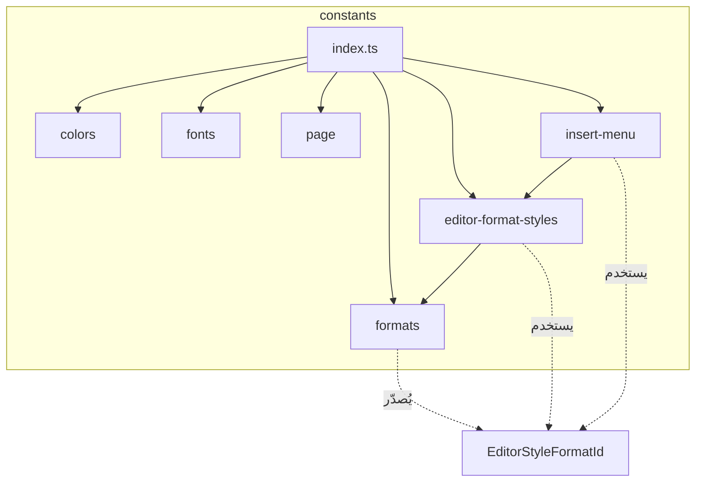
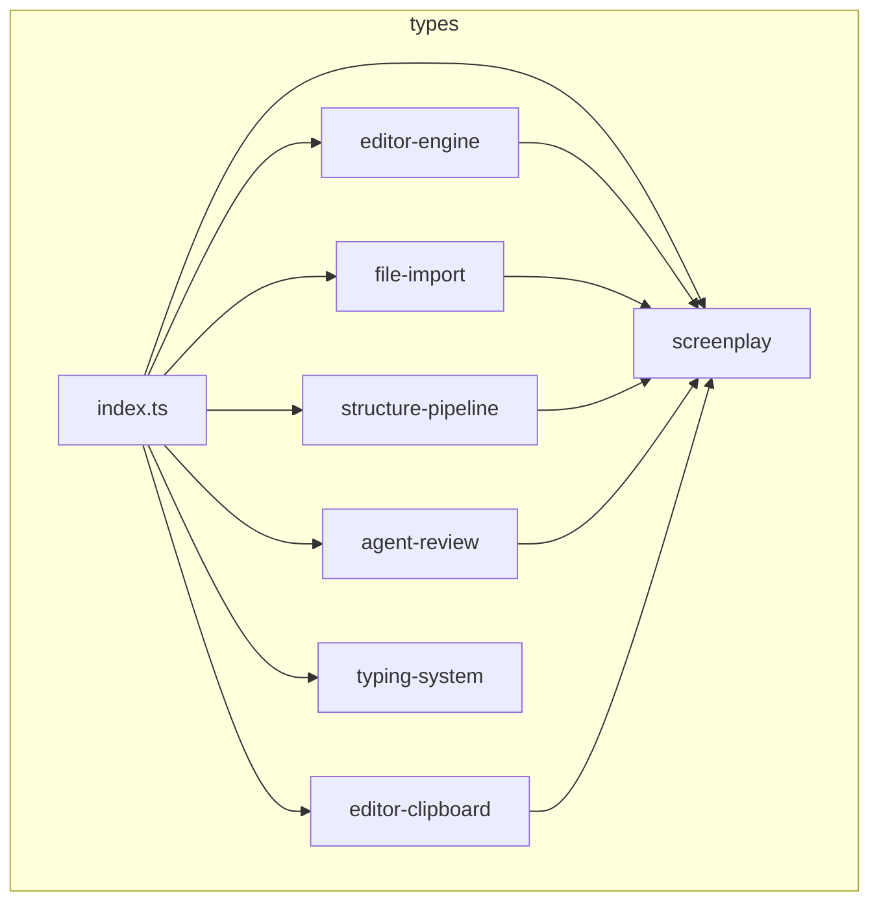
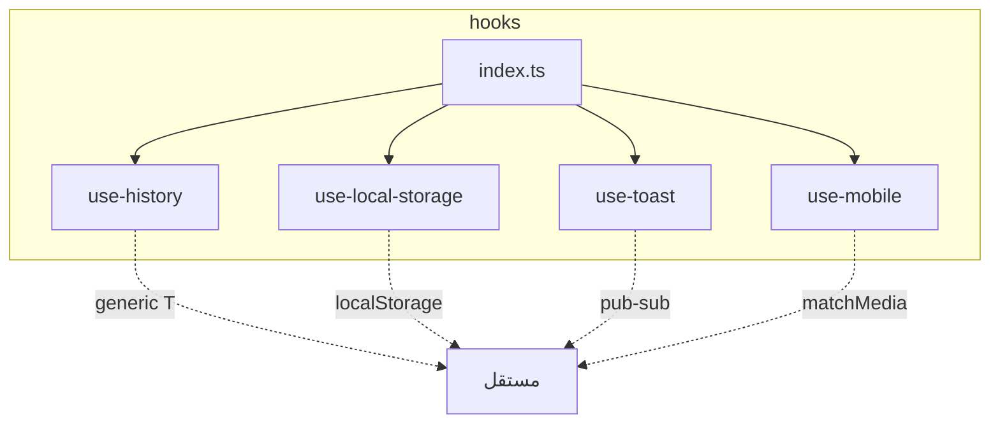
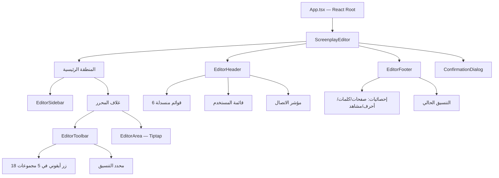

# خرائط علاقات الملفات — أفان تيتر (Avan Titre)

> آخر تحديث: 2026-02-22
> مبنية على الاستيرادات الفعلية (import statements) وليس على افتراضات.

---

## 1. خريطة التبعيات العامة بين المجلدات



---

## 2. خريطة استيرادات `main.tsx` — نقطة الدخول



---

## 3. خريطة استيرادات `App.tsx` — المكون الجذر



---

## 4. خريطة `components/editor/` — مكونات المحرر



---

## 5. خريطة `extensions/` — خط أنابيب التصنيف والعُقد

```mermaid
flowchart TD
    subgraph العُقد المخصصة
        BASM[basmala]
        SH1[scene-header-1]
        SH2[scene-header-2]
        SH3[scene-header-3]
        SHTL[scene-header-top-line]
        ACT[action]
        CHAR[character]
        DLG[dialogue]
        PAREN[parenthetical]
        TRANS[transition]
    end

    subgraph خط_التصنيف
        AP[arabic-patterns]
        CT[classification-types]
        CC[classification-core]
        CD_EXT[classification-decision]
        CSR[classification-sequence-rules]
        CMM[context-memory-manager]
        HC[hybrid-classifier]
        PC[paste-classifier]
        LR_EXT[line-repair]
        TU[text-utils]
        SCC[screenplay-commands]
    end

    HC --> AP
    HC --> CT
    HC --> CC
    HC --> CD_EXT
    HC --> CSR
    HC --> CMM

    PC --> HC
    PC --> CT
    PC --> CMM

    CC --> CT
    CC --> AP
    CD_EXT --> CT
    CSR --> CT

    SCC --> CT

    BASM --> SCC
    SH1 --> SCC
    SH2 --> SCC
    SH3 --> SCC
    SHTL --> SCC
    ACT --> SCC
    CHAR --> SCC
    DLG --> SCC
    PAREN --> SCC
    TRANS --> SCC

    LR_EXT --> AP
    LR_EXT --> CT

    style AP fill:#029784,color:#fff
    style HC fill:#40A5B3,color:#fff
    style PC fill:#746842,color:#fff
```

---

## 6. خريطة `utils/file-import/` — خط أنابيب الاستيراد



---

## 7. خريطة `constants/` — الثوابت



---

## 8. خريطة `types/` — الأنماط



---

## 9. خريطة `hooks/`



كل خطاف مستقل تماماً — لا تبعيات متبادلة.

---

## 10. أهم 3 تدفقات للمستخدم

### التدفق 1: الكتابة المباشرة

```
المستخدم → App.tsx → ScreenplayEditor → EditorArea → Tiptap Instance
  → [Enter] → Node Extension (addKeyboardShortcuts) → إنشاء عقدة جديدة
  → [Tab] → ScreenplayCommands → تدوير النوع
```

### التدفق 2: استيراد ملف

```
المستخدم → App.tsx → ScreenplayEditor.openFile()
  → file-picker → extract (backend|browser) → preprocessor
  → structure-pipeline | plain-text-to-blocks
  → hybrid-classifier (لكل سطر)
  → document-model → EditorArea.importBlocks()
```

### التدفق 3: لصق نص

```
المستخدم → Ctrl+V → EditorArea (paste event)
  → ScreenplayEditor.pasteFromClipboard()
  → [تحقق MIME مخصص] → إذا filmlane-blocks: إدراج مباشر
  → إذا نص عادي: paste-classifier → hybrid-classifier → إدراج مُصنّف
```

---

## 11. التسلسل الهرمي للواجهة البصرية



---

## 12. جدول الاعتمادات الخارجية المباشرة

| الملف | يعتمد على (خارجي) |
|-------|-------------------|
| `editor.ts` | `@tiptap/core`, `@tiptap/starter-kit` |
| `EditorArea.ts` | `@tiptap/core` (Editor instance) |
| `components/ui/_factory.ts` | `@radix-ui/*` (عبر التغليف) |
| `components/ui/*.ts` | `@radix-ui/*` (مكونات فردية) |
| `lib/utils.ts` | `clsx`, `tailwind-merge` |
| `hooks/use-toast.ts` | لا شيء (تنفيذ محلي بالكامل) |
| `providers/ThemeProvider.ts` | لا شيء (تنفيذ محلي بالكامل) |
| `main.tsx` | `react`, `react-dom` |
| `App.tsx` | `react` |

---

## 13. الملفات الأكثر استيراداً (Hub Files)

| الملف | عدد الملفات التي تستورده |
|-------|-------------------------|
| `types/screenplay.ts` | ~15+ |
| `extensions/classification-types.ts` | ~10+ |
| `extensions/arabic-patterns.ts` | ~8+ |
| `constants/formats.ts` | ~7+ |
| `constants/editor-format-styles.ts` | ~5+ |
| `lib/utils.ts` | ~50+ (كل مكونات ui/) |
| `extensions/screenplay-commands.ts` | 10 (كل عُقد السيناريو) |
