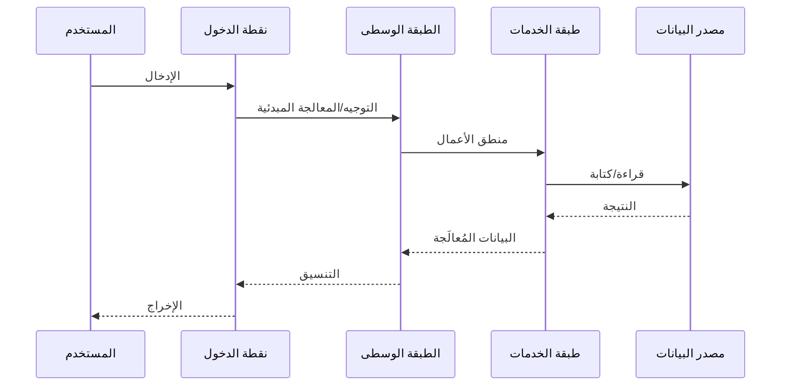
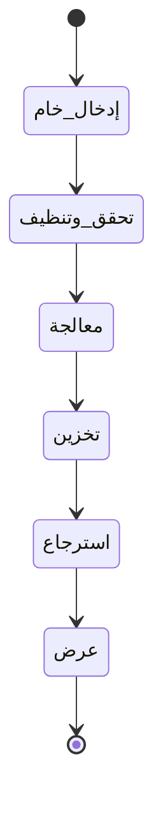
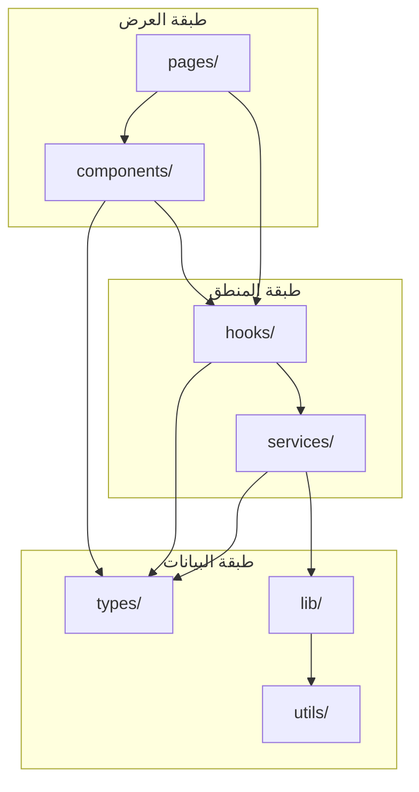
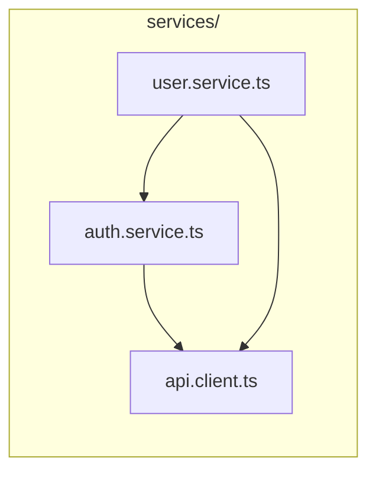
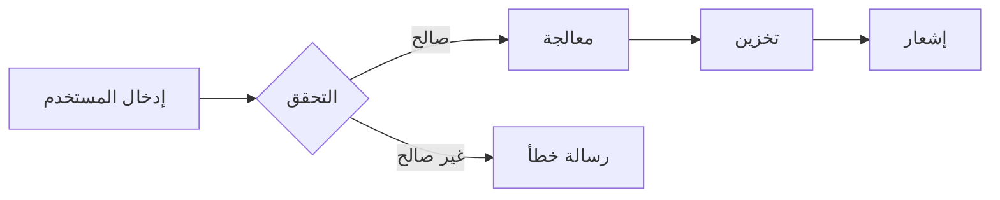
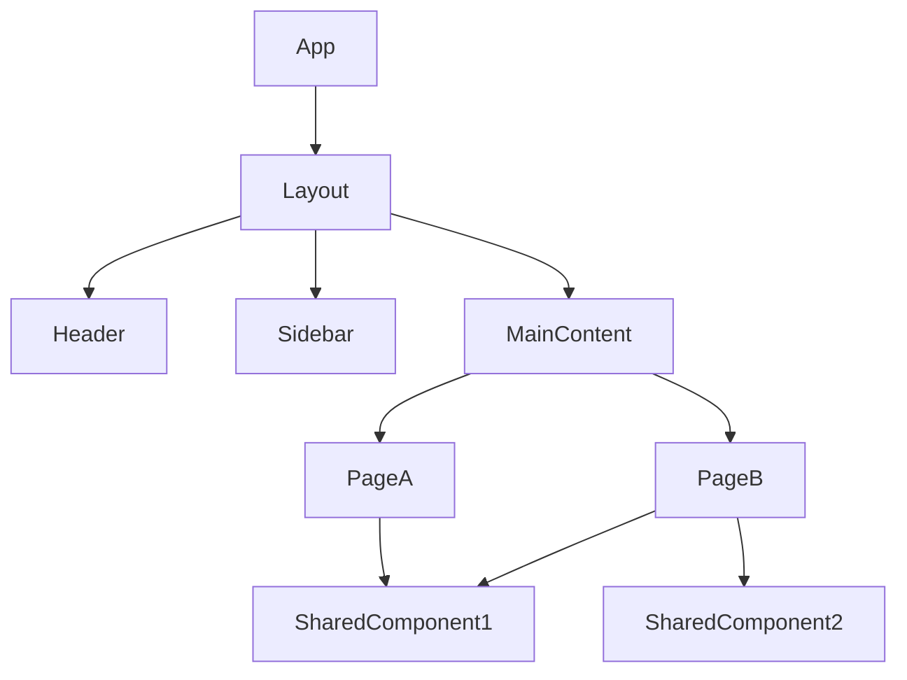

# docs-writing.md

---

## Steps

# سير عمل توثيق المشروع الشامل

## مبادئ تشغيل مختصرة
1. جولة واحدة لكل نوع معلومة: تجميع الملاحظات في أول مسح وتجنب إعادة قراءة نفس المصادر.
2. التدرّج: توثيق سريع ودقيق أولاً، ثم تعميق الوحدات الحرجة فقط.
3. الأتمتة أولاً: الاعتماد على أوامر استخراج الجرد والعلاقات لتقليل العمل اليدوي.
4. تعريف إنجاز واضح: كل مرحلة تُغلق بمخرجات محددة قابلة للفحص.

---

## المخرجات النهائية وتعريف الإنجاز (DoD)

| المخرج | الحد الأدنى للإنجاز | فحص سريع |
|---|---|---|
| `docs/PROGRESS.md` | جرد + حالات + عدادات | محدّث بعد كل مرحلة |
| `docs/CORE_MECHANISM.md` | مسار التنفيذ + دورة البيانات + طبقات + قرارات | رسوم Mermaid تعمل + مسار واضح |
| `docs/FILE_RELATIONS.md` | علاقات import فعلية + 3 تدفقات + هرمية UI (إن وجدت) | لا علاقات مفترضة |
| `README.md` | 19 قسم، والناقص placeholders محددة | أقسام التشغيل/التهيئة دقيقة |
| توثيق داخل الكود | JSDoc/TSDoc للواجهة العامة + المختصر للداخلي | إضافة فقط دون حذف/تعديل منطق |

---

## المرحلة 0: إعداد سريع (مرة واحدة)
**الهدف:** تجهيز استخراج الجرد والعلاقات بأقل احتكاك.

```bash
git ls-files > docs/_inventory_files.txt
tree -a -L 4 -I 'node_modules|dist|build|.git|.next' > docs/_tree_L4.txt
```

**إنشاء:** `docs/PROGRESS.md` بالقالب التالي:

```md
# PROGRESS

## 1) Inventory
- Files: ⬜
- Entry points: ⬜
- Public API surface: ⬜

## 2) Core Mechanism
- Execution path: ⬜
- Data lifecycle: ⬜
- Architecture layers table: ⬜
- ADRs (min 3): ⬜

## 3) Relations
- Folder dependencies graph: ⬜
- Per-folder import graphs: ⬜
- Top 3 user flows: ⬜
- UI hierarchy (if applicable): ⬜

## 4) Module-by-module Docs
- src/types (⬜/🔄/✅)
- src/utils (⬜/🔄/✅)
- ...

## Counters
- Documented files: 0
- Documented exported functions: 0
- Documented classes: 0
- Mermaid diagrams: 0
```

---

## المرحلة 1: المسح السريع الموحّد
**الهدف:** التقاط الصورة العامة من الجذور + سطح الواجهة العامة + نقطة الدخول دون تكرار.

1. قراءة الملفات الجذرية قراءة سريعة (مرة واحدة):
   - `package.json` / `requirements.txt`
   - `tsconfig.json` / `pyproject.toml`
   - `.env.example`
   - الجذرية الأخرى: `next.config.*`, `tailwind.config.*`, `eslint*`, `prettier*`, `vitest/jest`… إلخ
2. تحديد نقطة الدخول (Entry Point) بدقة:
   - Web: `src/app/layout.tsx` أو `src/pages/_app.tsx` أو `src/main.ts`
   - CLI: `bin` في `package.json` أو `entry_points` في `pyproject.toml`
   - Library: `main/exports` في `package.json`
3. تحديد “سطح الواجهة العامة”:
   - Public API: ما يُعاد تصديره من `index.ts`/barrel أو ما يُعلن كواجهة مكتبة/SDK أو ما يُستخدم خارجياً.
   - Internal Exports: ما يُستخدم داخلياً فقط.
4. تحديث `docs/PROGRESS.md`:
   - Inventory: 🔄 ثم ✅ عند تثبيت نقطة الدخول وسطح الواجهة العامة.

---

## المرحلة 2: تحليل آلية العمل الأساسية (CORE_MECHANISM)
**الهدف:** توثيق ما يحدث عند التشغيل ودورة البيانات بشكل صحيح ومباشر.

**إنشاء:** `docs/CORE_MECHANISM.md` ويحتوي على:
1. ملخص تنفيذي (فقرة واحدة): ماذا يفعل المستودع ولماذا.
2. مسار التنفيذ الرئيسي (Sequence Diagram):



3. دورة حياة البيانات (State Diagram):



4. جدول الطبقات المعمارية:

| الطبقة | المسؤولية | المسارات/الملفات | المدخلات | المخرجات |
|---|---|---|---|---|

5. قرارات معمارية جوهرية (3 ADRs كحد أدنى):
   - القرار
   - السبب
   - البدائل
   - التبعات (Trade-offs)

تحديث `docs/PROGRESS.md`:
- Core Mechanism: 🔄 ثم ✅ عند اكتمال العناصر الخمسة.

---

## المرحلة 3: كتابة README مبدئي (قابل للاستخدام)
**الهدف:** README صحيح وقابل للتشغيل بسرعة.

1. إنشاء `README.md` وفق قالب 19 قسم.
2. كتابة ما هو ثابت فقط من الاستطلاع.
3. وضع placeholders محددة للأقسام غير المكتملة:
   - `<!-- سيتم التحديث بعد توثيق المجلدات -->`
4. Architecture:
   - Component Diagram مبدئي من شجرة الملفات المختصرة.
5. ADRs:
   - توثيق 3 قرارات هندسية واضحة مبنية على ما تم رصده فعلاً.

---

## المرحلة 4: رسم خرائط العلاقات بين الملفات (FILE_RELATIONS)
**الهدف:** علاقات مبنية على imports الفعلية فقط.

**إنشاء:** `docs/FILE_RELATIONS.md` ويحتوي على:

1. تبعيات المجلدات (مستوى عالٍ):



2. تبعيات الملفات داخل المجلدات الحرجة فقط (3–6 مجلدات نواة):
   - استخرج العلاقات من `import` الفعلية.
   - لا تُدرج علاقات غير مثبتة في الكود.



3. تدفق البيانات لأهم 3 سيناريوهات استخدام:



4. هرمية المكونات (إن كان UI موجوداً):



تحديث `docs/PROGRESS.md`:
- Relations: 🔄 ثم ✅ عند وجود الرسوم الأربعة (حتى لو جزئياً للمجلدات الأساسية).

---

## المرحلة 5: التوثيق مجلد بمجلد (Gate & Upgrade)
**الهدف:** توثيق سريع شامل ثم تعميق انتقائي للواجهة العامة.

### ترتيب الأولوية
1. `src/types/` أو `src/models/`
2. `src/utils/` أو `src/lib/`
3. `src/services/` أو `src/api/`
4. `src/app/` أو `src/pages/`
5. `src/components/` و `src/hooks/` (إن وجدت)
6. باقي المجلدات

### داخل كل مجلد: مرحلتان

#### (أ) توثيق أساسي سريع لكل ملف (إلزامي)
- وصف الملف (سطران).
- قائمة exports (عناوين فقط).
- أهم الاعتماديات الخارجية الواضحة.

#### (ب) توثيق عميق للواجهة العامة فقط (انتقائي)
- كل Class/Function ضمن Public API: توثيق عميق كامل.
- الدوال الداخلية: توثيق مختصر كافٍ للفهم، دون إلزام تعدد أمثلة مبالغ فيه.

### قالب التوثيق العميق للدوال (Public API)

```typescript
/**
 * @description وصف شامل لما تفعله الدالة ولماذا توجد.
 *
 * @param {نوع} اسم_المعامل - وصف دقيق للمعامل.
 *   - القيم المقبولة: [القيم الممكنة أو النطاق]
 *   - القيمة الافتراضية: [إن وُجدت]
 *   - ماذا يحدث لو كانت null/undefined: [السلوك]
 *
 * @returns {نوع} وصف القيمة المُرجَعة.
 *   - في حالة النجاح: [ما الذي يُرجَع بالضبط]
 *   - في حالة الفشل: [ما الذي يُرجَع أو يُرمى]
 *   - حالات الحافة: [سلوك القيم الحدية]
 *
 * @throws {نوع_الخطأ} متى يحدث هذا الخطأ ولماذا
 *
 * @complexity الزمنية: O(n) | المكانية: O(1)
 *
 * @sideEffects
 *   - [تأثيرات جانبية: كتابة/تعديل حالة/طلبات شبكة...]
 *   - "لا يوجد" إذا كانت دالة نقية
 *
 * @dependencies
 *   - [الدوال/الخدمات التي تعتمد عليها]
 *
 * @usedBy
 *   - [المواضع التي تستدعيها — من بحث فعلي]
 *
 * @example الاستخدام الأساسي
 * ```typescript
 * const result = functionName(input);
 * console.log(result);
 * ```
 *
 * @example التعامل مع الأخطاء
 * ```typescript
 * try {
 *   functionName(invalidInput);
 * } catch (error) {
 *   // ...
 * }
 * ```
 *
 * @example حالة حافة
 * ```typescript
 * const result = functionName(edgeCaseInput);
 * console.log(result);
 * ```
 */
```

### بعد إنهاء كل مجلد (إلزامي)
1. تحديث `docs/PROGRESS.md`: حالة ✅ + العدادات.
2. تحديث `docs/FILE_RELATIONS.md`: تعديل الرسوم بناءً على العلاقات المكتشفة.
3. تحديث `README.md`: الأقسام المتأثرة فقط.
4. تحديث `docs/CORE_MECHANISM.md`: فقط إذا تغيّر فهم المسار.

---

## المرحلة 6: الختام والمراجعة (Quality Gate) ⏳
- [x] فحص أخطاء TypeScript.
- [x] مراجعة جميع التعليقات الإنجليزية (إن وجدت) وتحويلها لمصطلحات عربية.
- [x] مطابقة `README.md` مع الأهداف النهائية.

---
**تم بحمد الله** الانتهاء من دورة التوثيق الشاملة لبيئة `Filmlane`.
1. `docs/CORE_MECHANISM.md`:
   - المسار مكتمل من الإدخال إلى الإخراج.
   - كل طبقة معمارية موثقة.
   - رسوم Mermaid تعكس الحالة الفعلية للكود.
2. `docs/FILE_RELATIONS.md`:
   - كل علاقة مبنية على import فعلي.
   - حذف أي علاقات غير مثبتة.
   - توثيق التبعيات الدائرية إن وُجدت.
3. `README.md`:
   - إزالة كل placeholders المتبقية.
   - روابط واضحة إلى `docs/CORE_MECHANISM.md` و `docs/FILE_RELATIONS.md`.
4. التحقق من جودة توثيق الدوال:
   - Public API: 3+ أمثلة لكل دالة.
   - `@usedBy` و `@dependencies` بقيم فعلية.
   - `@throws` لكل دالة تتعامل مع أخطاء.
5. تحديث `docs/PROGRESS.md`: كل المجلدات ✅ + ملخص أعداد (ملفات/دوال/كلاسات/رسوم).

---

## صيانة التوثيق (Documentation Maintenance)

### دورة حياة التوثيق

```
┌─────────────┐    ┌─────────────┐    ┌─────────────┐    ┌─────────────┐
│   كتابة     │ →  │   مراجعة    │ →  │   نشر       │ →  │   تحديث     │
│  التوثيق    │    │   النظرية   │    │   التوثيق   │    │   الدوري    │
└─────────────┘    └─────────────┘    └─────────────┘    └─────────────┘
       │                  │                  │                  │
       ▼                  ▼                  ▼                  ▼
   الكود الجديد      فريق المراجعة      README.md       مع كل تغيير
```

### قواعد التحديث

| الحدث                    | الإجراء المطلوب                                                          |
| ------------------------ | ------------------------------------------------------------------------ |
| إضافة ميزة جديدة         | تحديث: Usage, Architecture, Changelog, CORE_MECHANISM (لو أثرت على المسار الرئيسي), FILE_RELATIONS (لو أضافت ملفات/تبعيات جديدة) |
| تغيير API/CLI            | تحديث: CLI Reference, Usage, Changelog                                  |
| إضافة تبعية              | تحديث: Prerequisites, مصفوفة التوافق, FILE_RELATIONS                     |
| إصلاح خطأ                | تحديث: Troubleshooting (إن كان شائعاً), Changelog                       |
| تغيير معماري             | تحديث: Architecture, ADRs, Data Flow, CORE_MECHANISM, FILE_RELATIONS     |
| تغيير متغيرات البيئة     | تحديث: Configuration, Installation                                      |
| إضافة/حذف ملف            | تحديث: FILE_RELATIONS (رسوم التبعيات)                                    |
| إعادة هيكلة (refactor)   | تحديث: FILE_RELATIONS, CORE_MECHANISM (لو تغير المسار), توثيق الدوال المتأثرة |

### قائمة التحقق للصيانة (Maintenance Checklist)
- [ ] التوثيق محدث مع آخر تغييرات الكود
- [ ] جميع الروابط تعمل بشكل صحيح
- [ ] أمثلة الكود قابلة للتنفيذ
- [ ] لا يوجد معلومات قديمة أو متضاربة
- [ ] جميع رسوم Mermaid تُعرض بشكل صحيح
- [ ] جميع الأقسام تستوفي معايير القبول الخاصة بها
- [ ] كل دالة مُصدَّرة لها 3+ أمثلة
- [ ] `docs/CORE_MECHANISM.md` يعكس المسار الفعلي الحالي
- [ ] `docs/FILE_RELATIONS.md` يعكس التبعيات الفعلية الحالية
- [ ] لا توجد تبعيات دائرية غير موثقة

> ⚠️ **تحذير**: التوثيق القديم أو غير الدقيق أسوأ من عدم وجود توثيق على الإطلاق.

---

## ملخص المخرجات النهائية

| الملف | المحتوى |
|-------|---------|
| `README.md` | التوثيق الرئيسي بـ 19 قسم + روابط للملفات الفرعية |
| `docs/PROGRESS.md` | تتبع حالة التوثيق لكل مجلد |
| `docs/CORE_MECHANISM.md` | شرح آلية العمل الأساسية + رسوم Sequence و State |
| `docs/FILE_RELATIONS.md` | خرائط العلاقات بين الملفات والمجلدات (رسوم Mermaid) |
| ملفات المصدر | توثيق JSDoc/TSDoc عميق مع أمثلة متعددة داخل كل ملف |

---

## قواعد مهمة

- **لا تحذف كود**: التوثيق إضافة فقط
- **لا تعدل منطق**: وثّق ما هو موجود كما هو
- **لو المشروع كبير**: ركّز على `src/` أولاً، ثم المجلدات الثانوية
- **لو اتقطعت الجلسة**: ارجع لـ `docs/PROGRESS.md` لمعرفة آخر نقطة وصلت إليها
- **التوثيق بالعربية** داخل JSDoc، أسماء المتغيرات تبقى بالإنجليزية
- **العلاقات من الكود فقط**: لا تفترض علاقة بين ملفين بدون `import` فعلي
- **رسوم Mermaid تُحدَّث تراكمياً**: كل مجلد جديد قد يكشف علاقات تستوجب تحديث الرسوم السابقة

# تقدم التوثيق — أفان تيتر (Avan Titre)

> آخر تحديث: 2026-02-22

## ملخص

| المقياس | القيمة |
|---------|--------|
| إجمالي الملفات | 132 |
| ملفات TypeScript/TSX | 124 |
| ملفات CSS | 6 |
| ملفات أخرى (md, json) | 2 |

## العدادات النهائية

| المقياس | العدد |
|---------|-------|
| ملفات موثقة (تحتوي JSDoc/TSDoc) | 65 |
| رموز مُصدّرة (functions, classes, types, consts) | 357 |
| فئات مُصدّرة (classes) | 12 |
| مخططات Mermaid | 18 |

## المراحل

| المرحلة | الوصف | الحالة |
|---------|-------|--------|
| 0 | إعداد سريع — جرد الملفات وشجرة المشروع | مكتمل |
| 1 | المسح السريع — نقطة الدخول وسطح الواجهة العامة | مكتمل |
| 2 | تحليل آلية العمل الأساسية — `CORE_MECHANISM.md` | مكتمل |
| 3 | كتابة `README.md` بـ 19 قسم | مكتمل |
| 4 | رسم خرائط العلاقات — `FILE_RELATIONS.md` | مكتمل |
| 5 | التوثيق مجلد بمجلد — JSDoc/TSDoc داخل الكود | مكتمل |
| 6 | المراجعة النهائية — Quality Gate | مكتمل |

## تفاصيل المرحلة 5 — التوثيق مجلد بمجلد

| المجلد | الحالة |
|--------|--------|
| `types/` | ✅ |
| `utils/` | ✅ |
| `constants/` | ✅ |
| `extensions/` | ✅ |
| `components/editor/` | ✅ |
| `hooks/` | ✅ |
| `providers/` | ✅ |
| `lib/` | ✅ |
| `src/` (ملفات الجذر) | ✅ |

## الملفات المُنتَجة

| الملف | المرحلة | الوصف |
|-------|---------|-------|
| `docs/PROGRESS.md` | 0 | هذا الملف — تتبع تقدم التوثيق |
| `docs/_inventory_files.txt` | 0 | جرد كامل لملفات المشروع |
| `docs/_tree_L4.txt` | 0 | شجرة المجلدات حتى المستوى الرابع |
| `docs/CORE_MECHANISM.md` | 2 | تحليل آلية العمل الأساسية مع مخططات Mermaid |
| `README.md` | 3 | الملف التعريفي الشامل بـ 19 قسم |
| `docs/FILE_RELATIONS.md` | 4 | خرائط علاقات الملفات بناءً على الاستيرادات الفعلية |

## هيكل المشروع — ملخص المجلدات

| المجلد | عدد الملفات | الوصف |
|--------|-------------|-------|
| `src/` (جذر) | 5 | نقطة الدخول + المحرر + شريط الأدوات القديم + إعلانات البيئة |
| `components/editor/` | 9 | المحرر الأساسي + المكونات المحيطة |
| `components/ui/` | 53 | مكونات Radix UI (نمط مصنع DOM) |
| `constants/` | 7 | الألوان، الخطوط، التنسيقات، أبعاد الصفحة |
| `extensions/` | 21 | عُقد Tiptap المخصصة + خط أنابيب التصنيف |
| `hooks/` | 5 | خطافات مخصصة (تاريخ، تخزين، إشعارات، موبايل) |
| `lib/` | 1 | أداة cn() |
| `providers/` | 2 | ThemeProvider (قائم على الفئات) |
| `styles/` | 6 | CSS مقسم حسب الاهتمام |
| `types/` | 8 | أنماط TypeScript |
| `utils/` | 2 | المسجل + أداة cn |
| `utils/file-import/` | 7 | خط أنابيب استيراد الملفات |
